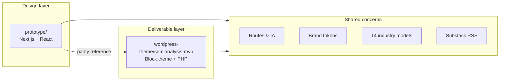

# SemiAnalysis — Institutional Research Funnel MVP

End-to-end redesign of the [SemiAnalysis](https://semianalysis.com) marketing experience: a **Next.js design prototype** for fast iteration and a **WordPress block theme** as the CMS-native deliverable. Both implementations share the same information architecture, brand system, and conversion goals.

**Author:** Babji Kilaru

---

## Table of contents

1. [Project overview](#project-overview)
2. [Repository structure](#repository-structure)
3. [Technology stack](#technology-stack)
4. [Architecture](#architecture)
5. [Pages and routes](#pages-and-routes)
6. [Getting started — prototype](#getting-started--prototype)
7. [Getting started — WordPress](#getting-started--wordpress)
8. [Deployment](#deployment)
9. [Development workflow](#development-workflow)
10. [Design system](#design-system)
11. [Documentation](#documentation)

---

## Project overview

SemiAnalysis sells institutional research products — **Industry Models**, **ChipBook**, and tailored engagements — to hedge funds, semiconductor executives, and hyperscaler infra teams. This MVP rebuilds the public funnel to:

| Objective | How it's addressed |
|-----------|-------------------|
| Drive inbound sales | Contact page, CTA bands, sticky sales bar, `/contact/` links site-wide |
| Showcase Industry Models | Filterable catalog with detail overlay on `/models` |
| Promote ChipBook | Dedicated product landing at `/products/chipbook` |
| Build credibility | Live Substack article feed on the homepage |
| Preserve editorial brand | Dark theme, Outfit typography, SA color tokens |

### Two implementations, one design

| | **Prototype** (`/prototype`) | **WordPress theme** (`/wordpress-theme`) |
|--|------------------------------|------------------------------------------|
| Role | Interactive design reference, Vercel deploy | LocalWP deliverable, editor-friendly CMS |
| Stack | Next.js 15, React 19, Tailwind 4, Framer Motion | WordPress 6.4 FSE block theme, PHP 8.1, vanilla CSS/JS |
| Data | TypeScript modules (`src/lib/`) | PHP modules (`inc/`) + `sa_product` CPT |
| Build | `npm run dev` / `npm run build` | No build step — copy theme directory |
| Contact | Placeholder `#` in prototype config | Live `/contact/` page with form UI |

The WordPress theme is the **primary submission deliverable**. The prototype is the **design source of truth** used to validate layout, motion, and UX before porting to PHP blocks.

---

## Repository structure

```
SemiAnalysis/
├── prototype/                    # Next.js 15 app — design prototype
│   ├── src/
│   │   ├── app/                  # App Router pages
│   │   ├── components/           # React UI (home, models, marketing, layout)
│   │   └── lib/                  # Site config, models catalog, Substack, content
│   └── package.json
│
├── wordpress-theme/
│   ├── README.md                 # Full theme documentation
│   └── semianalysis-mvp/         # Installable WordPress block theme
│       ├── blocks/               # 11 custom Gutenberg blocks (sa/*)
│       ├── inc/                  # PHP: models data, RSS, CPT, seeding, contact
│       ├── templates/            # FSE HTML templates
│       ├── parts/                # Header, footer
│       └── assets/               # theme.css (~6.8k lines), theme.js
│
├── scripts/
│   └── setup-localwp.sh          # Sync theme into LocalWP
│
└── README.md                     # This file
```

---

## Technology stack

### Prototype

| Layer | Choice |
|-------|--------|
| Framework | Next.js 15 (App Router) |
| UI | React 19 |
| Styling | Tailwind CSS 4 |
| Animation | Framer Motion 12 |
| Language | TypeScript 5.8 |
| Linting | ESLint + `eslint-config-next` |

### WordPress theme

| Layer | Choice |
|-------|--------|
| CMS | WordPress 6.4+ (Full Site Editing) |
| Language | PHP 8.1+ |
| Blocks | Custom `sa/*` Gutenberg blocks with `render.php` |
| Styling | `theme.json` tokens + hand-written `assets/css/theme.css` |
| Scripting | Vanilla JS IIFE (`assets/js/theme.js`, deferred) |
| Typography | Outfit via Google Fonts |
| Local dev | LocalWP |
| External data | Substack RSS (1-hour transient cache) |

Neither sub-project uses a page builder, WooCommerce, or ACF. Content is code-defined or seeded on theme activation.

---

## Architecture



### Prototype flow

1. User hits an App Router page (`app/page.tsx`, `app/models/page.tsx`, etc.).
2. Page composes React client/server components from `src/components/`.
3. Data comes from `src/lib/site.ts`, `src/lib/models.ts`, `src/lib/content.ts`, `src/lib/substack.ts`.
4. Framer Motion handles page transitions, hero animations, and overlay motion.

### WordPress flow

1. WordPress resolves a template (`templates/front-page.html`, `page-models.html`, etc.).
2. Template renders template parts (`header`, `footer`) and `sa/*` blocks.
3. Each block's `render.php` calls helpers in `inc/` and outputs semantic HTML.
4. `theme.js` adds carousels, filters, overlays, scroll reveals, and sticky bar behavior.

Detailed theme architecture: [wordpress-theme/README.md](wordpress-theme/README.md).

---

## Pages and routes

| Page | Prototype | WordPress |
|------|-----------|-----------|
| Homepage | `/` | `/` |
| Industry Models | `/models` | `/models/` |
| Model detail overlay | `/models?model=slug` | `/models/?model=slug` |
| ChipBook | `/products/chipbook` | `/products/chipbook/` |
| About | `/about` | `/about/` |
| Contact | — (placeholder) | `/contact/` |

### Homepage sections (both)

Hero → Funnel path → Industry models showcase → ChipBook feature → Substack articles → Why SemiAnalysis → CTA band

### WordPress-only surfaces

- **Contact page** — inquiry form, sales sidebar (submit UI disabled pending SMTP wiring)
- **Sticky sales bar** — bottom institutional access strip (hidden on contact page)
- **Auto-seeded CPT** — 6 `sa_product` posts on theme activation

---

## Getting started — prototype

### Prerequisites

- Node.js 18+
- npm

### Step 1 — Install dependencies

```bash
cd prototype
npm install
```

### Step 2 — Run dev server

```bash
npm run dev
```

Open [http://localhost:3000](http://localhost:3000).

### Step 3 — Build for production

```bash
npm run build
npm start
```

### Key source files

| File | Purpose |
|------|---------|
| `src/lib/site.ts` | External URLs, nav links |
| `src/lib/models.ts` | 14-model catalog + specs |
| `src/lib/content.ts` | Product copy, about content |
| `src/lib/substack.ts` | RSS fetch for article carousel |
| `src/app/globals.css` | Tailwind + SA design tokens |

---

## Getting started — WordPress

### Prerequisites

- [LocalWP](https://localwp.com/) (or WordPress 6.4+ with PHP 8.1+)
- macOS default path: `~/Local Sites/<site-name>/`

### Step 1 — Create a LocalWP site

Create a site named e.g. `semianalysis-mvp` (PHP 8.1+, WordPress 6.4+).

### Step 2 — Install the theme

From the repository root:

```bash
./scripts/setup-localwp.sh semianalysis-mvp
```

This copies `wordpress-theme/semianalysis-mvp` into the site's `wp-content/themes/` directory.

Manual alternative:

```bash
cp -r wordpress-theme/semianalysis-mvp \
  "~/Local Sites/semianalysis-mvp/app/public/wp-content/themes/"
```

### Step 3 — Activate the theme

1. Start the site in LocalWP.
2. WP Admin → **Appearance** → **Themes** → activate **SemiAnalysis MVP**.

On first activation the theme seeds:

- Home, Models, About, and Contact pages
- 6 `sa_product` posts (ChipBook + model products)
- Front page assignment

### Step 4 — Verify

| URL | What to check |
|-----|---------------|
| `http://semianalysis-mvp.local/` | Hero, carousels, Substack feed |
| `/models/` | Filters, catalog cards, overlay |
| `/products/chipbook/` | ChipBook landing, tracker panels |
| `/about/` | About narrative, CTA band |
| `/contact/` | Contact form layout |

If routes 404: WP Admin → **Settings** → **Permalinks** → **Save Changes**.

After code changes, re-run the setup script and hard-refresh (`Cmd+Shift+R`).

Full theme docs: [wordpress-theme/README.md](wordpress-theme/README.md).

---

## Deployment

### Prototype (Vercel)

Live preview: **https://semianalysis-prototype.vercel.app/**

Auto-deploys on push to `main` from the `prototype/` directory.

Manual deploy:

```bash
cd prototype
npx vercel --prod
```

GitHub: [BabjiKilaru/SemiAnalysis](https://github.com/BabjiKilaru/SemiAnalysis)

### WordPress theme

The theme is not cloud-hosted in this repo. Deploy by copying `wordpress-theme/semianalysis-mvp` to any WordPress host's `wp-content/themes/` directory, or use the LocalWP sync script during development.

---

## Development workflow

### Typical iteration loop

1. Prototype a UI change in `prototype/` — validate layout and motion in the browser.
2. Port markup and styles to the matching `sa/*` block `render.php` and `assets/css/theme.css`.
3. Add or adjust behavior in `assets/js/theme.js` if needed.
4. Sync to LocalWP:

   ```bash
   ./scripts/setup-localwp.sh semianalysis-mvp
   ```

5. Hard-refresh the LocalWP site.

### Editing catalog data

| Data | Prototype | WordPress |
|------|-----------|-----------|
| Industry models | `prototype/src/lib/models.ts` | `wordpress-theme/semianalysis-mvp/inc/models-data.php` |
| Site URLs | `prototype/src/lib/site.ts` | `wordpress-theme/semianalysis-mvp/inc/site-config.php` |
| Product copy | `prototype/src/lib/content.ts` | `sa_product` CPT meta + seed in `inc/seed-content.php` |

### Re-seeding WordPress content

```sql
DELETE FROM wp_options WHERE option_name = 'sa_mvp_seeded';
DELETE FROM wp_options WHERE option_name = 'sa_mvp_contact_page_v1';
```

Deactivate and reactivate the theme. For a clean slate, delete existing seeded pages and products first.

---

## Design system

Shared across both implementations:

| Token | Value | Usage |
|-------|-------|-------|
| SA Amber | `#F7B041` | Primary CTAs |
| SA Cobalt | `#0B86D1` | Links, badges |
| SA Mint | `#2EAD8E` | Secondary accents |
| SA Coral | `#E06347` | Alerts, hero nodes |
| Background | `#0A0A0A` | Page base |
| Foreground | `#F5F5F5` | Body text |
| Muted | `#A3A3A3` | Supporting copy |

**Typography:** [Outfit](https://fonts.google.com/specimen/Outfit) (400–700)

**Layout:** Max content width ~720px, wide layout ~1152px

**Components:** Pill buttons (primary / secondary / ghost), gradient headline text, dark editorial cards, reduced-motion fallbacks.

---

## Documentation

| Document | Scope |
|----------|-------|
| [README.md](README.md) | This file — monorepo overview |
| [PROGRESS.md](PROGRESS.md) | Day 1–7 build log |
| [wordpress-theme/README.md](wordpress-theme/README.md) | Block theme architecture, blocks, PHP modules, troubleshooting |

---

## Requirements summary

| | Prototype | WordPress |
|--|-----------|-----------|
| Runtime | Node.js 18+ | PHP 8.1+ |
| Platform | Next.js 15 | WordPress 6.4+ |
| Database | — | MySQL 5.7+ / MariaDB 10.3+ |
| Build tools | npm | None |


