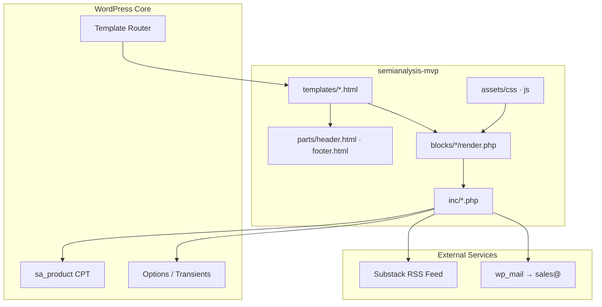

# SemiAnalysis MVP — WordPress Block Theme

Production-style WordPress block theme for the [SemiAnalysis](https://semianalysis.com) institutional research funnel. Implements the redesigned landing experience, Industry Models catalog, ChipBook product page, About page, and Contact page — aligned with the Next.js prototype in `/prototype`.

**Theme slug:** `semianalysis-mvp`  
**Current version:** `1.19.0` (asset cache-bust in `functions.php`)

---

## Table of contents

1. [Overview](#overview)
2. [Technology stack](#technology-stack)
3. [Architecture](#architecture)
4. [Project structure](#project-structure)
5. [Step-by-step setup](#step-by-step-setup)
6. [Routes and templates](#routes-and-templates)
7. [Custom blocks](#custom-blocks)
8. [PHP modules](#php-modules)
9. [Frontend assets](#frontend-assets)
10. [Data layer](#data-layer)
11. [Design system](#design-system)
12. [Configuration](#configuration)
13. [Development workflow](#development-workflow)
14. [Troubleshooting](#troubleshooting)
15. [Relationship to prototype](#relationship-to-prototype)

---

## Overview

This theme is a **Full Site Editing (FSE) block theme** built for WordPress 6.4+. It does not rely on page builders or third-party plugins. All marketing surfaces are composed from:

- **HTML block templates** (`templates/`, `parts/`)
- **Custom Gutenberg blocks** (`blocks/`) with server-side `render.php`
- **PHP data modules** (`inc/`) for catalog content, feeds, and form handling
- **Vanilla CSS and JavaScript** (`assets/`) for layout, motion, and interactivity

On theme activation, the theme **auto-seeds** demo content: product posts, static pages, and front-page assignment — so a fresh LocalWP install is immediately browsable.

### Goals

| Goal | Implementation |
|------|----------------|
| Drive institutional inbound | Contact page, CTA bands, sticky sales bar, `/contact/` links across CTAs |
| Showcase Industry Models | Filterable catalog with detail overlay (`/models/`) |
| Promote ChipBook | Dedicated product landing (`/products/chipbook/`) |
| Build credibility | Live Substack RSS on homepage |
| Match prototype UX | Shared IA, brand tokens, section parity with Next.js app |

---

## Technology stack

| Layer | Technology | Notes |
|-------|------------|-------|
| CMS | WordPress 6.4+ | Block theme (FSE), no classic PHP templates |
| Language | PHP 8.1+ | Strict typing patterns, WordPress APIs |
| Templating | HTML templates + `block.json` | Site Editor compatible |
| Styling | CSS custom properties + `theme.json` | ~6,800 lines in `assets/css/theme.css` |
| Scripting | Vanilla ES5 IIFE | No build step; `theme.js` loaded with `defer` |
| Typography | [Outfit](https://fonts.google.com/specimen/Outfit) | Google Fonts CDN |
| Local dev | [LocalWP](https://localwp.com/) | Primary target environment |
| External data | Substack RSS | Cached via WordPress transients |

**Intentionally excluded:** React, npm build pipeline, ACF, WooCommerce, page builders. The theme is self-contained and deployable by copying a single directory.

---

## Architecture

The theme follows a **block-first, server-rendered** pattern. WordPress loads a template, which references template parts and custom blocks. Each block's `render.php` pulls data from `inc/` helpers and outputs semantic HTML. Client-side behavior is layered in `theme.js` via data attributes and progressive enhancement.



### Request lifecycle (example: `/models/`)

1. WordPress resolves the **Models** page and applies the `page-models` custom template.
2. Template renders `header` → `sa/model-catalog` block → `sa/cta-band` → `footer`.
3. `model-catalog/render.php` calls `sa_mvp_get_models()` and outputs the catalog markup.
4. `theme.js` initializes filters, deep-link overlay (`?model=slug`), and keyboard dismissal.
5. CSS from `theme.json` tokens + `theme.css` provides layout and dark-theme styling.

### Bootstrap sequence

`functions.php` defines constants and loads modules in dependency order:

```
site-config.php → models-data.php → hero-visual.php → substack.php
→ enqueue.php → register-cpt.php → register-blocks.php
→ contact-form.php → seed-content.php
```

Blocks auto-register via glob in `inc/register-blocks.php` — no manual block list to maintain.

---

## Project structure

```
wordpress-theme/
└── semianalysis-mvp/                 # Installable theme root
    ├── style.css                     # Theme metadata (WP header)
    ├── theme.json                    # FSE tokens: colors, typography, templates
    ├── functions.php                 # Bootstrap + SA_MVP_VERSION
    ├── index.php                     # Required WP fallback
    │
    ├── templates/                    # Block HTML templates
    │   ├── front-page.html           # Homepage
    │   ├── page-models.html          # Industry Models hub
    │   ├── page-about.html           # About page
    │   ├── page-contact.html         # Contact page
    │   ├── single-sa_product.html    # Product landing (ChipBook, etc.)
    │   ├── page.html                 # Generic page fallback
    │   └── index.html                # Blog/archive fallback
    │
    ├── parts/                        # Reusable template parts
    │   ├── header.html               # Fixed nav, mobile menu
    │   └── footer.html               # Footer nav + sticky sales bar
    │
    ├── blocks/                       # Custom Gutenberg blocks (sa/*)
    │   ├── hero/
    │   ├── funnel-path/
    │   ├── industry-models/
    │   ├── chipbook-feature/
    │   ├── article-cards/
    │   ├── value-props/
    │   ├── cta-band/
    │   ├── model-catalog/
    │   ├── about/
    │   ├── contact/
    │   └── product-single/
    │
    ├── inc/                          # PHP logic (no templates)
    │   ├── site-config.php           # URLs, email constants
    │   ├── models-data.php           # 14-model catalog dataset
    │   ├── hero-visual.php           # Shared orbital hero SVG markup
    │   ├── substack.php              # RSS fetch + parse + cache
    │   ├── enqueue.php               # Asset loading, theme supports
    │   ├── register-cpt.php          # sa_product post type + meta
    │   ├── register-blocks.php       # Auto block registration
    │   ├── contact-form.php          # Form handler (POST + wp_mail)
    │   └── seed-content.php          # Activation seeding
    │
    └── assets/
        ├── css/theme.css             # All component styles
        ├── js/theme.js               # Interactions (carousels, overlays, etc.)
        └── images/                   # Logo, favicon
```

---

## Step-by-step setup

### Prerequisites

- [LocalWP](https://localwp.com/) (or any WordPress 6.4+ environment)
- PHP **8.1+**
- WordPress **6.4+**
- macOS path convention for LocalWP: `~/Local Sites/<site-name>/`

### Step 1 — Create a LocalWP site

1. Open **LocalWP** → **Create a new site**.
2. Name it e.g. `semianalysis-mvp`.
3. Choose **Preferred** environment (PHP 8.1+, nginx/Apache).
4. Set admin credentials and start the site.

### Step 2 — Install the theme

**Option A — Setup script (recommended)**

From the repository root:

```bash
./scripts/setup-localwp.sh semianalysis-mvp
```

The script finds a matching LocalWP site, removes the old theme copy, and syncs `wordpress-theme/semianalysis-mvp` into:

```
~/Local Sites/semianalysis-mvp/app/public/wp-content/themes/semianalysis-mvp
```

**Option B — Manual copy**

```bash
cp -r wordpress-theme/semianalysis-mvp \
  "~/Local Sites/semianalysis-mvp/app/public/wp-content/themes/"
```

### Step 3 — Activate the theme

1. Start the site in LocalWP.
2. Open **WP Admin** → **Appearance** → **Themes**.
3. Activate **SemiAnalysis MVP**.

On activation, `sa_mvp_seed_products()` runs once and creates:

- 6 `sa_product` posts (ChipBook + model products)
- Pages: **Home**, **Industry Models**, **About**
- Front page set to **Home**
- Contact page via `sa_mvp_ensure_contact_page()` (also runs on `init` for existing installs)

### Step 4 — Verify routes

| URL | Expected content |
|-----|------------------|
| `/` | Hero, funnel, models showcase, ChipBook, Substack articles, value props, CTA |
| `/models/` | Models hero, featured spotlight, filterable catalog, detail overlay |
| `/models/?model=accelerator-model` | Models page with overlay open |
| `/products/chipbook/` | ChipBook full product landing |
| `/about/` | About hero, methodology, services, CTA band |
| `/contact/` | Contact form + sales info sidebar |

### Step 5 — Hard refresh after changes

Theme assets use `filemtime()` cache busting. After syncing files, force-reload:

- **macOS:** `Cmd + Shift + R`
- Or open DevTools → disable cache while developing

### Step 6 — Permalinks (if routes 404)

WP Admin → **Settings** → **Permalinks** → click **Save Changes** (flushes rewrite rules for `sa_product` and pages).

---

## Routes and templates

| Route | WP entity | Template | Primary block(s) |
|-------|-----------|----------|------------------|
| `/` | Page: Home | `front-page.html` | `sa/hero` … `sa/cta-band` |
| `/models/` | Page: Industry Models | `page-models.html` | `sa/model-catalog`, `sa/cta-band` |
| `/about/` | Page: About | `page-about.html` | `sa/about`, `sa/cta-band` |
| `/contact/` | Page: Contact | `page-contact.html` | `sa/contact` |
| `/products/{slug}/` | `sa_product` CPT | `single-sa_product.html` | `sa/product-single` |

Custom templates are registered in `theme.json` under `customTemplates`.

### Template parts

| Part | File | Responsibility |
|------|------|----------------|
| Header | `parts/header.html` | Logo, primary nav, login/subscribe, mobile drawer |
| Footer | `parts/footer.html` | Brand column, Products/Company links, sticky sales bar |

The sticky sales bar is **hidden on the contact page** (`theme.js` + CSS `:has()` guard).

---

## Custom blocks

All blocks live under `blocks/<name>/` with `block.json` + `render.php`. Namespace: `sa/<name>`. Category: **SemiAnalysis**.

| Block | Name | Used on | Purpose |
|-------|------|---------|---------|
| Hero | `sa/hero` | Homepage | Full-viewport hero, orbital visual, rotating words, stats |
| Funnel Path | `sa/funnel-path` | Homepage | Three-step conversion funnel |
| Industry Models | `sa/industry-models` | Homepage | Featured models carousel + CTA |
| ChipBook Feature | `sa/chipbook-feature` | Homepage | ChipBook promo with device mockup |
| Article Cards | `sa/article-cards` | Homepage | Substack RSS article grid/carousel |
| Value Props | `sa/value-props` | Homepage | "Why SemiAnalysis" pillars |
| CTA Band | `sa/cta-band` | Homepage, Models, About | Conversion strip (`#sa-conversion-band`) |
| Model Catalog | `sa/model-catalog` | Models page | Filters, cards, detail overlay |
| About | `sa/about` | About page | Full about narrative + stack visual |
| Contact | `sa/contact` | Contact page | Hero + inquiry form + sidebar |
| Product Single | `sa/product-single` | Product CPT | ChipBook-specific layout or generic product |

### Block registration

```php
// inc/register-blocks.php
foreach ( glob( $blocks_dir . '/*/block.json' ) as $block_json ) {
    register_block_type( dirname( $block_json ) );
}
```

Adding a new block: create `blocks/my-block/block.json` + `render.php` — no extra registration code required.

---

## PHP modules

| File | Role |
|------|------|
| `site-config.php` | External URLs (newsletter, events, careers), `SA_MVP_CONTACT_EMAIL`, `sa_mvp_contact_sales_url()` |
| `models-data.php` | `sa_mvp_get_models()` — 14 industry models with specs, categories, featured flags |
| `hero-visual.php` | `sa_mvp_render_hero_visual()` — shared orbital ring markup for hero blocks |
| `substack.php` | `sa_mvp_get_substack_articles()` — RSS fetch, XML parse, 1-hour transient cache |
| `enqueue.php` | Google Font, `theme.css`, `theme.js`, editor styles, favicon |
| `register-cpt.php` | `sa_product` CPT + REST meta fields |
| `register-blocks.php` | Block category + auto-registration |
| `contact-form.php` | POST handler: nonce, honeypot, validation, `wp_mail` (ready; UI submit currently disabled) |
| `seed-content.php` | One-time seed on activation + contact page ensure on `init` |

### Custom post type: `sa_product`

- **Rewrite slug:** `/products/`
- **Meta fields:** `sa_tagline`, `sa_cta_label`, `sa_cta_email`, `sa_featured`, `sa_investors`, `sa_executives`, `sa_includes`
- **REST-enabled** for block editor / future headless use

ChipBook uses a specialized layout branch inside `product-single/render.php` when `post_name === 'chipbook'`.

---

## Frontend assets

### CSS (`assets/css/theme.css`)

Single stylesheet organized by page/section:

- Global tokens (`--sa-amber`, `--sa-cobalt`, `--sa-bg`, etc.)
- Header, footer, buttons, typography
- Homepage sections (hero, funnel, carousels)
- Models page (catalog, overlay, filters)
- ChipBook page (fixed background, tracker panels)
- About page (hero, abstraction stack)
- Contact page (form, notices)
- Reduced-motion overrides

`theme.json` defines the WordPress preset palette; `theme.css` mirrors tokens as `--sa-*` variables for block markup outside core blocks.

### JavaScript (`assets/js/theme.js`)

Vanilla IIFE, `defer` loaded. Modules:

| Module | Behavior |
|--------|----------|
| Sticky sales bar | Shows after scroll threshold; hides near CTA band; dismissible |
| Header scroll | Adds scrolled state to fixed header |
| Mobile nav | Toggle + focus trap |
| Hero word rotator | Cycles headline words (CSS fallback without JS) |
| Industry models carousel | Drag/scroll carousel on homepage |
| Article carousel | Substack cards horizontal scroll |
| Scroll reveal | IntersectionObserver section animations |
| Stat count-up | Animated numerals in hero stats |
| Model catalog | Category filters, overlay open/close, `?model=` deep links |
| ChipBook trackers | Tab panels on product page |
| ChipBook background | Scroll-based opacity fade on fixed watermark |
| About stack | Interactive abstraction layer highlight |

No bundler — edit `theme.js` directly; version cache busts via `filemtime()`.

---

## Data layer

### Industry models (14 entries)

Defined in `inc/models-data.php`. Categories: `compute`, `infrastructure`, `semiconductor`, `research`. Each model includes:

- `slug`, `name`, `tagline`, `description`, `category`
- `specs`: date range, granularity, access level, update cadence, coverage, entities
- Optional `featured` flag and custom `href` (e.g. ChipBook → `/products/chipbook/`)

Homepage showcase and models catalog both consume `sa_mvp_get_models()`.

### Substack articles

- **Feed:** `https://newsletter.semianalysis.com/feed`
- **Cache:** WordPress transient, 1 hour TTL
- **Fallback:** Static placeholder cards if fetch fails
- **Parser:** Custom regex XML parser (no external RSS library dependency)

### Seeded products (6 CPT posts)

Created once per install (`sa_mvp_seeded` option). Mirrors key sellable products; ChipBook slug drives the dedicated product template.

### Contact form

Server handler in `inc/contact-form.php` supports:

- Fields: name, email, company, inquiry type, message
- Security: WordPress nonce, honeypot field
- Delivery: `wp_mail()` to `sales@semianalysis.com` with `Reply-To` header

> **Note:** The contact form UI currently renders a non-submitting "Send message" button (`type="button"`). Re-enable by restoring `method="post"`, form `action`, and `type="submit"` in `blocks/contact/render.php`.

---

## Design system

### Brand colors

| Token | Hex | Usage |
|-------|-----|-------|
| SA Amber | `#F7B041` | Primary CTAs, accents |
| SA Cobalt | `#0B86D1` | Links, badges, gradients |
| SA Mint | `#2EAD8E` | Secondary accents |
| SA Coral | `#E06347` | Alerts, hero nodes |
| Background | `#0A0A0A` | Page base |
| Elevated | `#141414` | Panels |
| Card | `#1A1A1A` | Cards, form surfaces |
| Border | `#2A2A2A` | Dividers |
| Foreground | `#F5F5F5` | Body text |
| Muted | `#A3A3A3` | Supporting copy |

### Typography

- **Family:** Outfit (400, 500, 600, 700)
- **Scale:** Defined in `theme.json` (`small` → `hero`)
- **Layout widths:** Content `720px`, wide `1152px` (`--sa-wide` in CSS)

### Components

- **Buttons:** `.sa-btn`, variants `--primary`, `--secondary`, `--ghost`, `--sm`
- **Motion:** `.sa-btn-lift`, `.sa-hero-reveal`, respects `prefers-reduced-motion`
- **Gradients:** `.sa-text-gradient` for headline emphasis

---

## Configuration

Edit `inc/site-config.php` for environment-specific URLs:

```php
define( 'SA_MVP_CONTACT_EMAIL', 'sales@semianalysis.com' );
define( 'SA_MVP_NEWSLETTER_SUBSCRIBE', 'https://newsletter.semianalysis.com/subscribe' );
define( 'SA_MVP_CHIPBOOK_SALES', 'mailto:ChipBookSales@SemiAnalysis.com' );
// … events, careers, login, sample PDF, etc.

function sa_mvp_contact_sales_url() {
    return home_url( '/contact/' );
}
```

All "Contact Sales" CTAs use `sa_mvp_contact_sales_url()` → `/contact/`.

Bump `SA_MVP_VERSION` in `functions.php` when you need to force cache invalidation beyond `filemtime()`.

---

## Development workflow

### Sync changes to LocalWP

```bash
./scripts/setup-localwp.sh semianalysis-mvp
```

Run after every theme edit during local development.

### Adding a new page

1. Create `templates/page-{slug}.html` referencing the appropriate `sa/*` block.
2. Register template in `theme.json` → `customTemplates`.
3. Create the WordPress page in admin (or seed in `inc/seed-content.php`).
4. Assign the custom template via `_wp_page_template` post meta.

### Adding a new block

1. `blocks/my-feature/block.json` — set `name`, `render` path.
2. `blocks/my-feature/render.php` — server-rendered HTML.
3. Styles in `assets/css/theme.css`; behavior in `assets/js/theme.js` if needed.
4. Reference block in a template: `<!-- wp:sa/my-feature /-->`.

### Editing model catalog data

Update `inc/models-data.php`. No database migration required — data is file-based.

### Editor preview

`enqueue.php` loads `theme.css` as editor styles for visual parity in the Site Editor.

---

## Troubleshooting

### Routes return 404

WP Admin → **Settings** → **Permalinks** → **Save Changes**.

### Content missing after activation

Seeding runs once. To re-seed:

```sql
DELETE FROM wp_options WHERE option_name = 'sa_mvp_seeded';
DELETE FROM wp_options WHERE option_name = 'sa_mvp_contact_page_v1';
```

Then **deactivate and reactivate** the theme. Warning: this does not delete existing posts — seed function exits early if `sa_mvp_seeded` is set. For a clean slate, delete seeded pages/products manually first.

### Substack articles not loading

- Confirm outbound HTTP works from LocalWP
- Check transient: articles cache for 1 hour
- Fallback cards render automatically on fetch failure

### Contact form email not received

LocalWP often lacks SMTP. Install an SMTP plugin (e.g. WP Mail SMTP) or inspect with a mail catcher like Mailhog if configured.

### Sticky bar overlaps content

Body receives `padding-bottom` when bar is visible. Bar is suppressed on `/contact/`.

### Styles look stale

Hard refresh (`Cmd+Shift+R`). Assets use `filemtime()` — if timestamps are unchanged, bump `SA_MVP_VERSION`.

---

## Relationship to prototype

| Aspect | Next.js (`/prototype`) | WordPress (`/wordpress-theme`) |
|--------|------------------------|--------------------------------|
| Purpose | Design reference + Vercel deploy | LocalWP deliverable, CMS-native |
| Routing | App Router pages | WP pages + CPT rewrite rules |
| Data | `src/lib/content.ts` | `inc/models-data.php`, CPT meta |
| Styling | Tailwind CSS | `theme.css` + `theme.json` |
| Interactivity | React client components | `theme.js` progressive enhancement |

Both share information architecture, brand tokens, and section order. The WordPress theme is the **installable, editor-friendly** implementation intended for content operators and PHP hosting environments.

---

## Requirements summary

| Requirement | Minimum |
|-------------|---------|
| WordPress | 6.4 |
| PHP | 8.1 |
| MySQL | 5.7+ / MariaDB 10.3+ |
| Node.js | Not required |

---

## License

GPL v2 or later (WordPress theme standard). See `semianalysis-mvp/style.css` theme header.

---

**Author:** Babji Kilaru  
**Theme path:** `wordpress-theme/semianalysis-mvp/`  
**Local URL (default):** `http://semianalysis-mvp.local`
